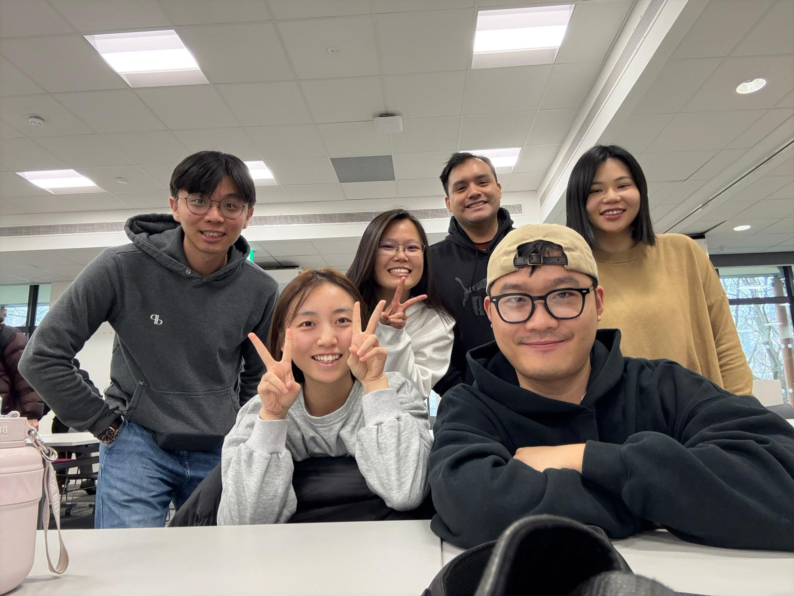
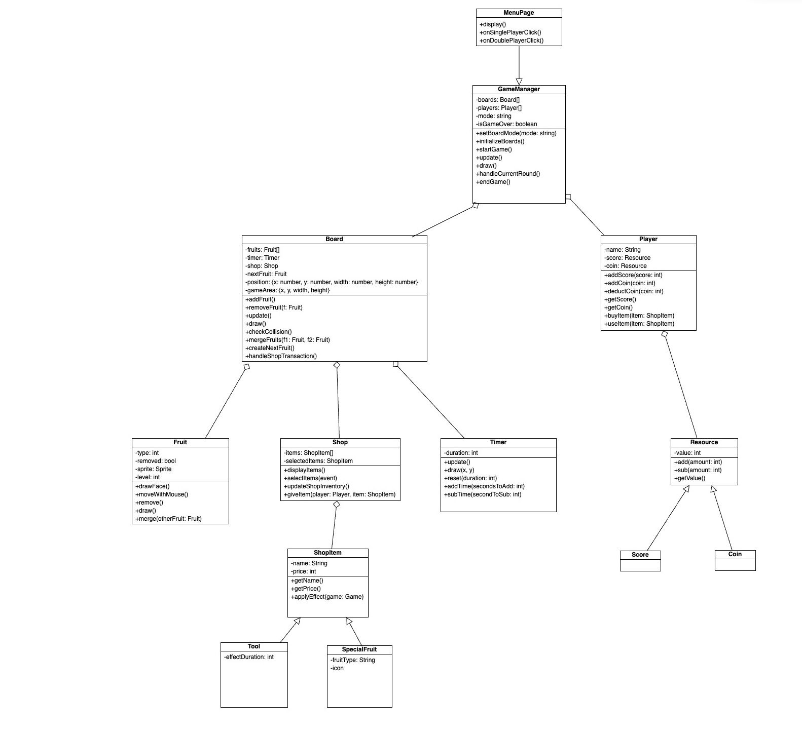
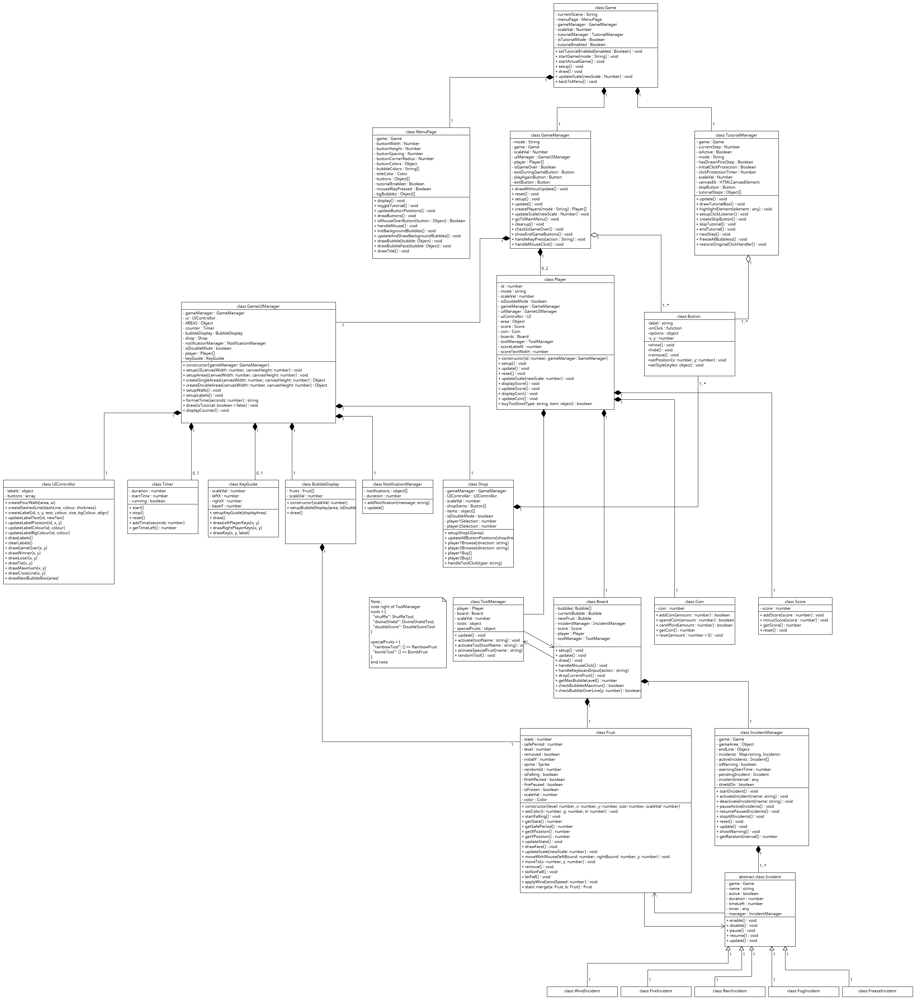
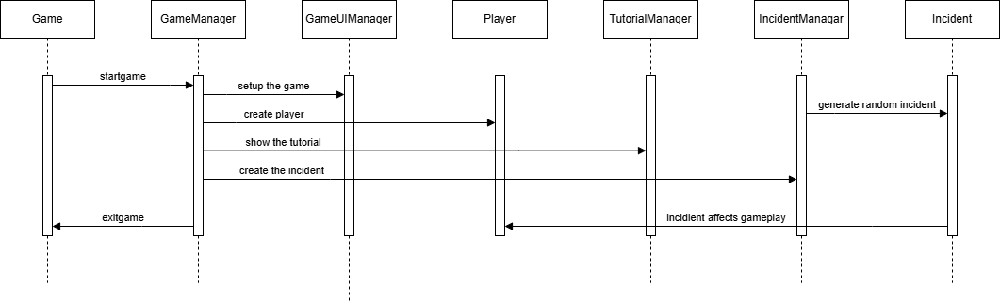
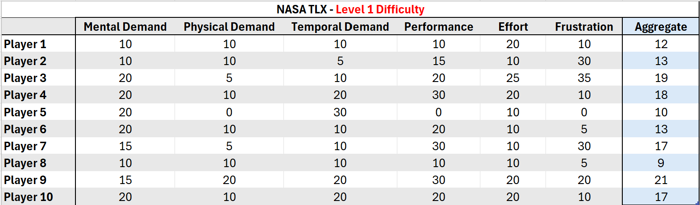
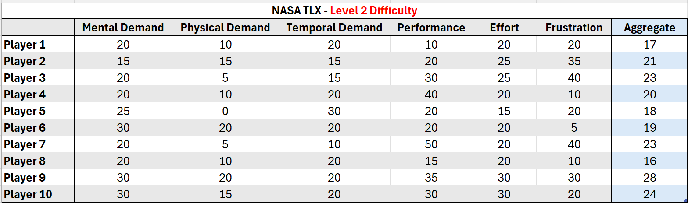

# 2025-group-2

2025 COMSM0166 group 2

## Links to weekly discussions

| Week Number |                                                                                                                                                                                                                                                                       Links                                                                                                                                                                                                                                                                       |
| :---------: | :-----------------------------------------------------------------------------------------------------------------------------------------------------------------------------------------------------------------------------------------------------------------------------------------------------------------------------------------------------------------------------------------------------------------------------------------------------------------------------------------------------------------------------------------------: |
|   Week 1    |                                                                                                                                                                                                  [meeting minutes](/ReportMaterial/MeetingMinutes/16Jan2025.txt)   [Kanban link](https://github.com/orgs/UoB-COMSM0166/projects/73/views/13)                                                                                                                                                                                                   |
|   Week 2    |                                                                                                                                                                                                  [meeting minutes](/ReportMaterial/MeetingMinutes/21Jan2025.txt)   [Kanban link](https://github.com/orgs/UoB-COMSM0166/projects/73/views/12)                                                                                                                                                                                                   |
|   Week 3    | [meeting minutes](/ReportMaterial/MeetingMinutes/28Jan2025.txt)   [merge fruit discussion drawings](/ReportMaterial/MeetingMinutes/28th.jpeg)   [merge fruit initial brainstorm](/ReportMaterial/ProgressTracker/merge-fruit-brainstorming-28Jan2025.pdf)   [flappy bird gameplay video for lab](/ReportMaterial/Week3PrototypeVideos/flappy-bird-ppt-gameplay.mp4)   [merge fruit gameplay video for lab](https://www.youtube.com/shorts/hrKJQ_CAGm4)   [Kanban link](https://github.com/orgs/UoB-COMSM0166/projects/73/views/14) |
|   Week 4    |                                 [meeting minutes](/ReportMaterial/MeetingMinutes/4thFeb2025.txt)   [merge fruit new brainstorm redrawn](/ReportMaterial/ProgressTracker/merge-fruit-redo-4Feb2025.pdf)   [merge fruit new discussion drawings](/ReportMaterial/ProgressTracker/Meeting%20pic%20on%204th%20Feb.jpeg)   [game requirements week4 lab](/ReportMaterial/Week4LabGameRequriments/week4-game-requirements.txt)   [Kanban link](https://github.com/orgs/UoB-COMSM0166/projects/73/views/15)                                  |
|   Week 5    |                                                                                                                                                               [meeting minutes](ReportMaterial/MeetingMinutes/11thFeb2025.txt)   [Kanban link](https://github.com/orgs/UoB-COMSM0166/projects/73/views/16)   [Class Diagram](/ReportMaterial/Diagrams/class-diagram-v1.jpeg)                                                                                                                                                                |
|   Week 7    |                                                                                                                              [meeting minutes 1](ReportMaterial/MeetingMinutes/24Feb2025.txt)   [meeting minutes 2](ReportMaterial/MeetingMinutes/25Feb2025.txt)   [Kanban link](https://github.com/orgs/UoB-COMSM0166/projects/73/views/17)   [Qualitative Evaluations](ReportMaterial/qualitative-evals/)                                                                                                                              |
|   Week 8    |                                                                                                                                                                 [meeting minutes](ReportMaterial/MeetingMinutes/4Mar2025.txt)   [Kanban link](https://github.com/orgs/UoB-COMSM0166/projects/73/views/19)   [Quantitative Evaluations](ReportMaterial/quantitative-evals/)                                                                                                                                                                  |

## Your Game

Link to your game [PLAY HERE](https://uob-comsm0166.github.io/2025-group-2/)

Your game lives in the [/docs](/docs) folder, and is published using Github pages to the link above.

Include a demo video of your game here (you don't have to wait until the end, you can insert a work in progress video)

## Your Group

|        Name         |         Email         |
| :-----------------: | :-------------------: |
|  Hayley Yi Li Tay   | zo24201@bristol.ac.uk |
| Doris Chia Chia Wu  | nq24705@bristol.ac.uk |
|      Shiyu Fan      | hp24308@bristol.ac.uk |
| Jimmy Chih Chun Lin | jp24407@bristol.ac.uk |
|   Octave Jin Liao   | ge24446@bristol.ac.uk |
|   Gerald Rodrigue   | nu24692@bristol.ac.uk |

## Introduction

- 5% ~250 words
- Describe your game, what is based on, what makes it novel?

## Requirements

- 15% ~750 words
- Use case diagrams, user stories. Early stages design. Ideation process. How did you decide as a team what to develop?

As a team, we discovered that assigning epics to our stakeholders significantly enhanced our ability to plan the next steps. For example, epics allowed us to define user stories and acceptance criteria in advance, enabling a deeper understanding of the features we needed to develop, such as the story of a player wanting to utilize a new game feature. This allows us to list out in more details all the requirements in the development of the game and note down ideas from different stakeholders' perspectives which we may or may not have missed out on if we were to approach this without using the method taught to us.

Furthermore, by having a clear understanding of the tasks at hand, we were able to create a detailed list of the necessary actions to implement changes and meet our stakeholders' needs, such as the specific tasks required to develop the new game feature. This gives our planning a more structured approach and we're thus less likely to make potentially fatal mistakes.

In conclusion, the requirements gathering process provided us with valuable insights on how to organize and prioritize activities to successfully fulfill the project requirements.

## Design

- 15% ~750 words
- System architecture. Class diagrams, behavioural diagrams.

Once we identified the stakeholders and evaluated the User Stories, we were able to determine a list of features to be implemented into our game, with the Use Case Model acting as a planning tool to guide us on the flow of our system behaviour from a user's perspective.

### System Architecture

Our game utilises several manager classes to handle the different areas of gameplay, essentially implementing a component-based architecture which follows an expanded Model-View-Controller pattern. This means that our game state, logic and rendering are each separated into different components.

The primary manager classes (found in the folder named "[core](/docs/core)") are:

1. **Game**: Main coordinator to manage all game states and transitions
2. **GameManager**: Focuses on controlling the physics, game logic and entity updates
3. **GameUIManager**: Focuses on managing UI components and all visual elements
4. **IncidentManager**: Focuses on handling the random events that were incorporated to increase game challenge and act as a twist to the original game
5. **ToolManager**: Focuses on controlling the tools found in our shop function
6. **UIController**: Focuses on rendering the UI elements and handling updates to the display

Creating multiple primary manager classes allows us to modify the different components independently. In the final version of our Class Diagram (covered in the section below), you can see clearly that the Game class sits at the top of the hierarchy, managing all the other manager classes.

### Class Diagram

We came up with an initial Class Diagram to help visualise the static structure of our system along with plotting the relationships between the different objects, following an Object Oriented Design (OOD) approach.

This first version was created by brainstorming together during a face-to-face session around reading week where we came up with the skeleton of the basic game we had in mind.

 
<em>Initial Class Diagram</em>

As we developed the game further and added in more features according to the various twists planned, like the double player mode, the shop function, the various new tools found in the shop function and the random incidences occuring during gameplay, code complexity quickly increased and refactoring became necessary.
This led to us creating the second and final Class Diagram.

 
<em>Final Class Diagram</em>

The final Class Diagram reflects our System Architecture by visualising the way our components relate to one another, with the Game class serving as the main controller and connecting to the GameManager, TutorialManager and MenuPage.

### Sequence Diagram

The Sequence Diagram gives an overview of how we want the flow of our gameplay to look like, along with how the objects should collaborate with each other during the gameplay.

 
<em>Sequence Diagram</em>

Here, we have the Sequence Diagram which shows the overarching gameplay. Our system architecture begins with the main menu where the player selects the game mode they want and also have the option to decide whether they would like to turn off the tutorials.

### Agile Approach

Since we worked while following the Agile methodology, there were very frequent updates and modifications made to the game design and a need to constantly keep our System Architecture, Class Diagram and Sequence Diagram up to date.

However, due to the fast pace at which we had to complete the project, we ultimately had to sacrifice on the documentations for this area and focus on developing working software instead, with the diagrams updated only when there was a lull or lesser tasks to complete between sprints. This is in line with the one of the key values of the Agile Manifesto: Working Software over Comprehensive Documentation.

This does appear to be an area for improvement as we believe that we could have had better control over our planning of tasks and not be overly ambitious every sprint in order to factor in more time to keep a better update of the diagrams and documentations.

## Implementation

- 15% ~750 words

- Describe implementation of your game, in particular highlighting the three areas of challenge in developing your game.

## Evaluation

- 15% ~750 words

<ins> Qualitative Evaluation </ins>  
The qualitative evaluations were collected in two stages:

- Stage 1 - the initial demo version
- Stage 2 - the improved version with modifications to address the feedbacks given during Stage 1

Evaluations collected at each stage allowed the team to gain a clearer understanding of player needs and expectations, allowing for improvements in the right direction before arriving at the final version that is enjoyable to the players of the game. Problems spotted by players during the different stages were addressed early which helped avoid unnecessary complications, and negative feedbacks drove improvement to overall gameplay experience.
 

_Stage 1 - Initial Demo Version (25th Feb 2025)_

> Think Aloud Evaluation
>
> > Positives Experiences:
> >
> > > - Shake Tool is a good function that adds to the playability of the game
> > > - The twist of having at least 5 different functions/tools made the game more fun and addicting
> > > - The eye movement on the balls is interesting
> >
> > Problems spotted:
> >
> > > - Rainbow function stops working intermittently
> > > - Bomb function does not cause explosion but merges normally instead
> >
> > Feedbacks for Improvement:
> >
> > > - Container (playing field) needs to be bigger
> > > - Description of all function/tools should be added
> > > - Will be good to show a list of all different sizes of balls

 

> Heuristic Evaluation:
>
> > | Interface               | Issue                                                                                                                                 | Heuristic                               | Frequency | Impact | Persistence | Severity |
> > | ----------------------- | ------------------------------------------------------------------------------------------------------------------------------------- | --------------------------------------- | --------- | ------ | ----------- | -------- |
> > | Single Player Main Game | End game criteria needs to be added as the game is just an infinite loop right now with no ending                                     | Visibility of System Status             | 4         | 4      | 4           | 4        |
> > | Single Player Main Game | There are no descriptions of the available tools in the game, only a button with the tool names. Players don't know what they are for | Help and documentation                  | 4         | 2      | 2           | 2.6      |
> > | Single Player Main Game | Players can't tell when the wind incidence is activated as there are no animations or indications, making it feel abrupt              | Visibility of System Status             | 3         | 3      | 2           | 2.6      |
> > | Single Player Main Game | Some functions like the Bomb tool does not work as expected (no explosions even though the name would imply an explosion)             | Match between System and the Real World | 4         | 2      | 2           | 2.6      |
> > | Single Player Main Game | Scores of the game needs to be more obvious                                                                                           | Visibility of System Status             | 2         | 1      | 1           | 1.3      |

 

Consolidating the feedbacks received from Stage 1 of our qualitative evaluation, we identified the following points for prioritisation:

- Players need a way to determine that the game has ended
- Tools not working as intended
- Description of tools need to be displayed
- More animations need to be included so it is obvious to players when an in-game event occurs

The points above were marked for prioritisation and as areas to focus on because they were either pointed out multiple times or that their negative impact on the game was huge.
A key issue that was given a score of 4 for severity was that there was no end to the game. This was a point that was noted down as the top priority for rectification.

Once we had the evaluations analysed for Stage 1, the next steps and development prioritisations became clearer. The first improvement to be pushed was to include a way for the players to determine when their game has ended, essentially breaking out of the infinite loop and attaching a goal to the game. A couple of tools that did not work as intended also had to be fixed so that the gameplay does not get negatively impacted. We also had to improve player experience by adding descriptions to the tools available in the game and additional animations for in-game event occurences. While the overall experience was positive, these were glaring issues that required our immediate attention before moving onto Stage 2.
 

_Stage 2 - Improved version (3rd Mar 2025)_

> Think Aloud Evaluation 1
>
> > Positives Experiences:
> >
> > > - The random incidents in the game is a good twist
> > > - Bomb tool and Rainbow tool helps make game easier
> >
> > Problems spotted:
> >
> > > - When two incidents occur together at the same time, sometimes it causes unwanted bugs
> >
> > Feedbacks for Improvement:
> >
> > > - Ensure that the bugs do not happen during gameplay when two incidents occur at the same time
> > > - "Currency" system should be implemented so it limits the things that players can buy

 

> Think Aloud Evaluation 2
>
> > Positives Experiences:
> >
> > > - There are 2 modes to the game now, adding a more interesting twist
> > > - Having the list of all fruit sizes on the side is a good addition
> > > - Game now has a clearer indication of how to end (example, fruits shouldn't go over the red line on playing field)
> >
> > Problems spotted:
> >
> > > - Double player mode still requires using the mouse to play, making it almost impossible for 2 players to play at the same time
> >
> > Feedbacks for Improvement:
> >
> > > - Add animation or a more obvious indication that the game has ended after player places fruit that goes over the red line in the playing field
> > > - Switch from using a mouse and instead use keyboard keys to play the game

 

With the modifications added according to the feedbacks received from Stage 1 of our qualitative evaluation, the feedbacks we received during Stage 2 leaned towards user experience improvements instead of critical fixes to make the game playable. Evaluating the feedbacks in Stage 2, it seems that the concerns raised during Stage 1 were addressed properly and received positively, which was a relief to the team. The remaining modifications to be made to the game at this point will mostly be to improve gameplay experience and to polish up the game.

At this point, keeping in mind the limited time remaining, the team listed down the different modifications we would still like to add to the game and ranked them according to priority to focus on.
   

<ins> Quantitative Evaluation using NASA TLX </ins>

For the quantitative evaluation, we approached ten random players to test out our game in two difficulty levels. All players were given a short introduction to our game prior to the start of the evaluations. The players then filled out both the NASA TLX and the System Usability Scale right after completing each difficulty level. To minimise learning effects, we arranged for five players to play the easier difficulty first before playing the harder difficulty, and for the other five players to play the harder difficulty first before playing the easier difficulty.

In this report, we will discuss the results from the NASA TLX assessment.

For the NASA TLX evaluation we received, we opted not to use weights, instead choosing to use the raw TLX scores. This decision was made in consideration of the fact that we want to eliminate the layer of subjectivity in the assessment, primarily because for our game, it was decided that each dimension in the NASA TLX is equally important. On top of that, there is also [research](https://www.jmir.org/2020/9/e19472/) which suggested that using raw TLX scores makes it easier to administer the NASA TLX.

Since both the Single Player mode and the Double Player mode in our game runs on essentially the same logics and mechanics, save for the different number of players involved per game, we decided that the evaluation this time should focus on getting the ten players to test out the core mechanics of our game using the Single Player mode for simplicity. The goal is to confirm whether the new additional twists that we added to the game managed to improve the gameplay difficulty and add depth.

In the Single Player mode, players will strive to get as high a score as possible before the game ends. The game ends when the player exceeds the allowable playing field by going over the red line in our game.

The first level of difficulty that the ten players tested out is the basic and plain version of our Single Player mode where the goal is to get as high as score as possible before the game ends as described above, with access to the in-game shop items.

The second level of difficulty that the ten players tested out is the full Single Player mode where on top of what they played with in the first level of difficulty, there is the addition of random Incidences occuring throughout gameplay to disrupt them. The existence of the random Incidences in our gameplay is a core mechanic and a key twist of our game that we decided must be evaluated.

> **Evaluation Results (4th Mar 2025)**
>
> > **_First Difficulty Level - Single Player Basic version_**
> >
> > 

> > 	
> > 

> >
> >  
> >
> > **_Second Difficulty Level - Single Player with Incidences_**
> >
> > 

> > 	
> > 

We evaluated the NASA TLX results received from the ten players using the Wilcoxon Signed Ranked Test to determine whether there is a significant difference between the two difficulty levels.

For the evaluation, we used an alpha value of 0.05 as we would like to be 95% certain that any significant differences found in our assessment is caused by real differences and not randomness. On a test with 10 sets of data, this means that we would require a W value of 8 or below for the test result to be statistically significant.

The calculated W value for our evaluation was 0, which is well below the critical value of 8 for our chosen alpha value.

The evaluated result confirms that the addition of our key twist and new core mechanic, i.e. the random Incidences, increases the difficulty level of our gameplay relative to the basic version and is statistically significant. This is a positive outcome as it assures the team that the direction we took in creating a twist to the game is correct and that the addition of the random Incidences made during the sprint over reading week was not in vain.

## Process

- 15% ~750 words

- Teamwork. How did you work together, what tools did you use. Did you have team roles? Reflection on how you worked together.

## Sustainability, ethics and accessibility

- 100% ~750 words

- Evidence of the impact of your game across the environment and two of the other areas:
  - Environmental + 2 of the following: Social, Economic, Technical, Individual

## Conclusion

We learnt a lot throughout this whole journey of creating a game from scratch, allowing us to grow through various challenges faced and expanding our repertoire of both soft and hard skills. This is especially true since none of the group members had any experience with game development or coding in p5.js.

Learning and adapting as we moved along, the development of the game was made easier after learning the Agile development methodology as we were able adopt a Scrum-Inspired Agile approach to design and develop the game in a much more structured way as opposed to the initial vague ideas that we had in mind. User feedback also turned out to be extremely important as it influenced the directions of our game, allowing us to further improve our game to make it more fun and enjoyable. Our team collected user feedback throughout the development of the game in order to further polish our game.

As we progressed in the development of the game, the complexity of our codes increased and modifications to any individual functions started to implicate other areas of the game in ways that were unexpected. Since the game was jointly developed by all members of the team, ensuring that we have effective communication and proper support for each other was crucial as we had to help each other understand all areas of the codes to prevent breaking any logics created by other members.

One main challenge was the integration of all "Incidences" and "Tools" within the game. These "Incidences" and "Tools" were developed by different team members and they all worked well when doing isolated testing. The problem came when they were all thrown together during a full playtesting, where we saw broken logics or unexpected bugs occurring because the codes on the backend clashed with each other. The cleaning up for this lasted for most of the second half of our project and required a lot of refactoring and redesigning.

Another challenge faced during development was the implementation of our shop function into the double player mode. Various considerations had to be taken in order to ensure that the different effects from items bought in the shared shop activates in the correct player's playing field, determining how each player can access the shared shop function individually at the same time without affecting gameplay, and not breaking any existing logics like in the previous challenge mentioned.

Both the challenges mentioned above were overcome by the team through many meetings between different team members to ensure all codes are fully understood before attempting any modifications. This helped prevent unwanted bugs from appearing and allowed development to proceed smoother after we learnt from the experience.

Perhaps due to our lack of experience and skills due to having come from various different backgrounds not related to software development, we were not able to fully adopt a Test-Driven Development (TDD) process for this game. A lot of our functions had to be tested through playtesting, finding new bugs this way and going back to resolve them, wasting a lot of time as there were always bugs missed out during the rounds of playtesting. This is an area for improvement and a lesson that the team will take to heart for future projects.

As for the future of Crazy Bubble itself, there were a few features that we would have liked to implement if there was enough time. Modifying the game into an online version with individual player accounts and storing each player's high scores in a database would allow the player to access their old game data and attempt to beat either their own previous high scores or get on the leaderboard for highest score across all players. With the online version also comes the possibility of a new game mode of playing with more than just one other opponent, much like [Tetris 99](https://www.nintendo.com/en-gb/Games/Nintendo-Switch-download-software/TETRIS-99-1505396.html) where 99 different opponents compete with each other. On a smaller scale, we would also have liked to add more tools into the shop function in our game, especially on the double player mode where adding more tools for disrupting other players would have made the game more interesting.

All members of our team agree that this was an invaluable experience as it allowed each of us to experience working in a team as developers, explore the different aspects of software engineering and challenge ourselves in a new way that we had never experienced before, all before actually stepping out into the industry. The lessons learnt in this project will be something that helps define us as we grow as software developers in the future.

## Contribution Statement

- Provide a table of everyone's contribution, which may be used to weight individual grades. We expect that the contribution will be split evenly across team-members in most cases. Let us know as soon as possible if there are any issues with teamwork as soon as they are apparent.

## Additional Marks

You can delete this section in your own repo, it's just here for information. in addition to the marks above, we will be marking you on the following two points:

- **Quality** of report writing, presentation, use of figures and visual material (5%)

  - Please write in a clear concise manner suitable for an interested layperson. Write as if this repo was publicly available.

- **Documentation** of code (5%)

  - Is your repo clearly organised?
  - Is code well commented throughout?
