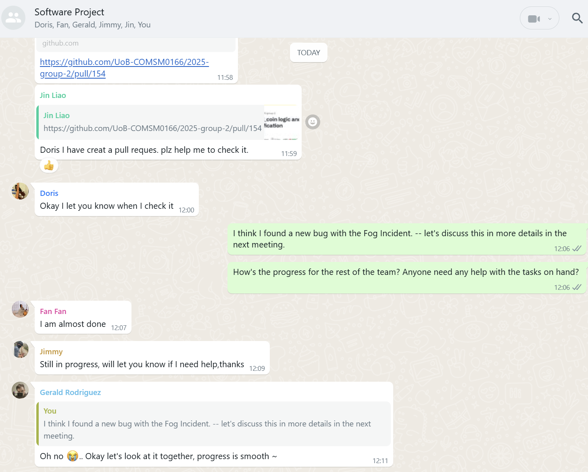
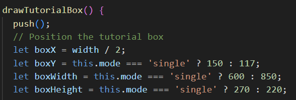

# 2025-group-2 <!-- omit from toc -->

2025 COMSM0166 group 2

📖 Content

- [Links to weekly discussions](#links-to-weekly-discussions)
- [Your Game](#your-game)
- [Team Members](#team-members)
- [Introduction](#introduction)
- [Requirements](#requirements)
  - [Ideation Process](#ideation-process)
  - [Stakeholders Identification](#stakeholders-identification)
  - [User Stories](#user-stories)
  - [Use Case Model](#use-case-model)
- [Design](#design)
  - [System Architecture](#system-architecture)
  - [Class Diagram](#class-diagram)
  - [Sequence Diagram](#sequence-diagram)
  - [Agile Approach](#agile-approach)
- [Implementation](#implementation)
- [Evaluation](#evaluation)
- [Process](#process)
- [Sustainability, ethics and accessibility](#sustainability-ethics-and-accessibility)
- [Conclusion](#conclusion)
- [Contribution Statement](#contribution-statement)
- [Additional Marks](#additional-marks)

## Links to weekly discussions

|     Week Number     |                                                                                                                                                                                                                                                                         Links                                                                                                                                                                                                                                                                         |
| :-----------------: | :---------------------------------------------------------------------------------------------------------------------------------------------------------------------------------------------------------------------------------------------------------------------------------------------------------------------------------------------------------------------------------------------------------------------------------------------------------------------------------------------------------------------------------------------------: |
|       Week 1        |                                                                                                                                                                                                    [meeting minutes](/ReportMaterial/MeetingMinutes/16Jan2025.txt)   [Kanban link](https://github.com/orgs/UoB-COMSM0166/projects/73/views/13)                                                                                                                                                                                                     |
|       Week 2        |                                                                                                                                                                                                    [meeting minutes](/ReportMaterial/MeetingMinutes/21Jan2025.txt)   [Kanban link](https://github.com/orgs/UoB-COMSM0166/projects/73/views/12)                                                                                                                                                                                                     |
|       Week 3        | [meeting minutes](/ReportMaterial/MeetingMinutes/28Jan2025.txt)   [crazy bubble discussion drawings](/ReportMaterial/MeetingMinutes/28th.jpeg)   [crazy bubble initial brainstorm](/ReportMaterial/ProgressTracker/crazy-bubble-brainstorming-28Jan2025.pdf)   [flappy bird gameplay video for lab](/ReportMaterial/Week3PrototypeVideos/flappy-bird-ppt-gameplay.mp4)   [crazy bubble gameplay video for lab](https://www.youtube.com/shorts/hrKJQ_CAGm4)   [Kanban link](https://github.com/orgs/UoB-COMSM0166/projects/73/views/14) |
|       Week 4        |                                  [meeting minutes](/ReportMaterial/MeetingMinutes/4thFeb2025.txt)   [crazy bubble new brainstorm redrawn](/ReportMaterial/ProgressTracker/crazy-bubble-redo-4Feb2025.pdf)   [crazy bubble new discussion drawings](/ReportMaterial/ProgressTracker/Meeting%20pic%20on%204th%20Feb.jpeg)   [game requirements week4 lab](/ReportMaterial/Week4LabGameRequriments/week4-game-requirements.txt)   [Kanban link](https://github.com/orgs/UoB-COMSM0166/projects/73/views/15)                                  |
|       Week 5        |                                                                                                                                                                 [meeting minutes](ReportMaterial/MeetingMinutes/11thFeb2025.txt)   [Kanban link](https://github.com/orgs/UoB-COMSM0166/projects/73/views/16)   [Class Diagram](/ReportMaterial/Diagrams/class-diagram-v1.jpeg)                                                                                                                                                                  |
|       Week 7        |                                                                                                                                [meeting minutes 1](ReportMaterial/MeetingMinutes/24Feb2025.txt)   [meeting minutes 2](ReportMaterial/MeetingMinutes/25Feb2025.txt)   [Kanban link](https://github.com/orgs/UoB-COMSM0166/projects/73/views/17)   [Qualitative Evaluations](ReportMaterial/qualitative-evals/)                                                                                                                                |
|  Week 8 and Week 9  |                                                                                                                                                                   [meeting minutes](ReportMaterial/MeetingMinutes/4Mar2025.txt)   [Kanban link](https://github.com/orgs/UoB-COMSM0166/projects/73/views/19)   [Quantitative Evaluations](ReportMaterial/quantitative-evals/)                                                                                                                                                                    |
| Week 10 and Week 11 |                                                                                                                                                                                                                                       [Kanban link](https://github.com/orgs/UoB-COMSM0166/projects/73/views/20)                                                                                                                                                                                                                                       |
|   Week 12 onwards   |                                                                                                                                                                                                                                       [Kanban link](https://github.com/orgs/UoB-COMSM0166/projects/73/views/21)                                                                                                                                                                                                                                       |

## Crazy Bubble Video Demonstration

 

Click on the image above to watch a game demonstration video of Crazy Bubble!

Interested in trying out the game for yourself? You can [play here](https://uob-comsm0166.github.io/2025-group-2/)!

## Team Members

|         Name          |         Email         |      Role      |
| :-------------------: | :-------------------: | :------------: |
|  Yi Li Tay (Hayley)   | zo24201@bristol.ac.uk |  Scrum Master  |
| Chia Chia Wu (Doris)  | nq24705@bristol.ac.uk | Lead Developer |
|       Shiyu Fan       | hp24308@bristol.ac.uk | Lead Designer  |
| Chih Chun Lin (Jimmy) | jp24407@bristol.ac.uk | Product Owner  |
|   Jin Liao (Octave)   | ge24446@bristol.ac.uk |   Developer    |
|   Gerald Rodriguez    | nu24692@bristol.ac.uk |   Developer    |

## Table of Contents

- [Introduction](https://github.com/UoB-COMSM0166/2025-group-2/tree/main?tab=readme-ov-file#introduction)
- [Requirements](https://github.com/UoB-COMSM0166/2025-group-2/tree/main?tab=readme-ov-file#requirements)
- [Design](https://github.com/UoB-COMSM0166/2025-group-2/tree/main?tab=readme-ov-file#design)
- [Implementation](https://github.com/UoB-COMSM0166/2025-group-2/tree/main?tab=readme-ov-file#implementation)
- [Evaluation](https://github.com/UoB-COMSM0166/2025-group-2/tree/main?tab=readme-ov-file#evaluation)
- [Process](https://github.com/UoB-COMSM0166/2025-group-2/tree/main?tab=readme-ov-file#process)
- [Sustainability, ethics and accessibility](https://github.com/UoB-COMSM0166/2025-group-2/tree/main?tab=readme-ov-file#sustainability-ethics-and-accessibility)
- [Conclusion](https://github.com/UoB-COMSM0166/2025-group-2/tree/main?tab=readme-ov-file#conclusion)
- [Contribution Statement](https://github.com/UoB-COMSM0166/2025-group-2/tree/main?tab=readme-ov-file#contribution-statement)

## Introduction

In `Crazy Bubble`, players get to experience the satisfying challenge of merging colourful and expressive bubbles to create increasingly larger ones while juggling strategic tool usage and navigating random incidences in a race against time and space. This seemingly simple concept challenges the player's spatial awareness and planning while remaining a fun and relaxing game that anyone, regardless of gaming experience, can enjoy.

The core gameplay revolves around dropping bubbles of different sizes and colour into a contained playing field. Collision between two bubbles of the same colour and size results in a merge that forms a larger bubble, rewarding players with points and coins. With the increase in size and number of bubbles in the playing field, the available space decreases, creating a natural difficulty progression that challenges the player's spatial reasoning and timing.

 
<em>Initial Class Diagram</em>

What makes our `Crazy Bubble` truly unique and novel are these three key twists:

> **1. Shop System**
>
> Coins earned through merges allows players to make purchases in the in-game shop, giving players access to gameplay-altering tools. Players can purchase helpful items like the "Rainbow Tool", which merges with any bubble, or disruptive items in the double player mode like the "Strong Wind" tool that blows the opponent's falling bubble off course.

> **2. Competitive Double Player Mode**
>
> The competitive double player mode adds another layer to the traditionally solitary game, allowing players more excitement and strategic depth as they race against time while attempting to gain an edge over each other.

> **3. Random "Incidences" Throughout Gameplay**
>
> These random "Incidences" that occur throughout gameplay introduces unexpected challenges like freezing certain bubbles to stop merges, or having certain bubbles catch fire such that merges results in a deduction of points and no coins awarded. This keeps players engaged and challenges them to be adaptive.
>
> 

> 
>  
> <em>Freeze Incident that stops certain bubbles from merging temporarily</em>
> 

By combining these three twists, we managed to create an engaging game that offers a unique blend of competitiveness and relaxation. `Crazy Bubble` delivers a satisfying experience that can be enjoyed in short sessions, allowing it to be the perfect respite after a long and stressful day.

## Requirements

### Ideation Process

Our team approached this project with a specific theme in mind: "fun games that you would play after a stressful day to unwind and is simple enough to complete in 3 months". This was a result of our team's shared experience on balancing work with relaxation, and recognizing the value of engaging games that offer quick enjoyment without a steep learning curve.

Each member brainstormed for ideas that fit the theme and included their suggestions onto the GitHub Kanban on the first week, which we then discussed on the following meeting.

 
<em>Ideation Meeting Minutes</em>

From the initial eight game ideas that we brainstormed, we narrowed our choice down to two ideas: "Merge Fruit" and "Flappy Bird".

The workshop on Week 3 where we created prototypes for both games allowed us to grasp the interest levels of players for both games and gather ideas on how to expand the game further, ultimately leading to us deciding to choose the relatively new "Merge Fruit" game.

 
<em>First Prototype (paper) developed during Week 3 Workshop</em>

A huge factor in our decision was due to the lesser number of variations of "Merge Fruit" available online, meaning that we had ample opportunities for original twists. Having experienced isolation during the Covid period, we knew we wanted to add a competitive double player mode to encourage connection and enjoyment with friends, which worked well for us since variations of the game online at the time of the ideation process only featured single player mode.

The simplicity of the game's concept also meant that the p5.js language which we're required to work with provided the perfect foundation for implementing our envisioned features while allowing for rapid development when paired with the P5play framework. This gave us the confidence that it was feasible to go ahead with the "Merge Fruit" game as our choice of game for this project.

We would eventually rename the game as "Crazy Bubble" following the various twists added and our game design.

 
<em>Second Prototype (digital) for design ideas during development - game now renamed "Crazy Bubble"</em>

### Stakeholders Identification

 
<em>Onion Model of Crazy Bubble</em>

When we started creating our Onion Model and listing down potential stakeholders, we came to the realisation that there were more stakeholder groups than we first anticipated. This was a good thing since it forces us to design our game by looking through the perspective of the various stakeholders, significantly enhancing our ability to plan the next steps in a structured and thorough way. This allows us to list out in more details all the requirements in the development of the game and note down ideas from different stakeholders' perspectives which we may or may not have missed out on if we were to approach this without using the method taught to us.

Furthermore, by having a clear understanding of the tasks at hand, we were able to create a detailed list of the necessary actions to implement changes and meet our stakeholders' needs, such as the specific tasks required to develop the new game feature. This gives our planning a more structured approach and we're thus less likely to make potentially fatal mistakes.

### User Stories

Based on the stakeholders listed out in our Onion Model, we created user stories to plan and prioritise the features to implement. These are a few examples of our user stories:

> As a Player of the Original Version looking for variations, I want to play a version of this game that comes with double player mode so that I can enjoy playing together with friends and family.

> As a Gamer, I want to be able to play the game with friends in double player mode but not have to input any personal details so that there is no risk of exposing my data online.

> As a Gamer, I want a tool in the game that helps to clear my playing field when I'm close to losing the game so that I can prolong my gameplay and enjoy the game further.

> As a Gamer, I want a tool that allows me to double my score so that I can beat my previous high score more easily.

> As a Gamer, I want each special tool to have their own distinct designs so that I can easily tell them apart at a glance.

> As a Tester, I want the game to be intuitive and user friendly, featuring a tutorial so that players can easily enjoy the game without a steep learning curve.

> As a COMSM0166 Professor, I want to be able to complete one round of the game within 5 minutes so that I can assess the game fast.

> As a Developer, I want clear instructions on features required and what to prioritise so that I can focus on developing and delivering the correct features on time.

### Use Case Model

Analysing the user stories on hand, we knew we had to design our game in a way that can be enjoyed by anyone regardless of gaming skills while implementing our twists. Since the double player mode was part of our twist, it was something we must implement by the end of the project.

In order to ensure that the various elements of the game are clear, we created the Use Case Model to aid and guide us in our development.

 
<em>Use Case Diagram</em>

 
<em>Use Case Specification</em>

## Design

- 15% ~750 words
- System architecture. Class diagrams, behavioural diagrams.

Once we identified the stakeholders and evaluated the User Stories, we were able to determine a list of features to be implemented into our game, with the Use Case Model acting as a planning tool to guide us on the flow of our system behaviour from a user's perspective.

### System Architecture

Our game utilises several manager classes to handle the different areas of gameplay, essentially implementing a component-based architecture which follows an expanded Model-View-Controller pattern. This means that our game state, logic and rendering are each separated into different components.

The primary manager classes (found in the folder named "[core](/docs/core)") are:

1. **Game**: Main coordinator to manage all game states and transitions
2. **GameManager**: Focuses on controlling the physics, game logic and entity updates
3. **GameUIManager**: Focuses on managing UI components and all visual elements
4. **IncidentManager**: Focuses on handling the random events that were incorporated to increase game challenge and act as a twist to the original game
5. **ToolManager**: Focuses on controlling the tools found in our shop function
6. **UIController**: Focuses on rendering the UI elements and handling updates to the display

Creating multiple primary manager classes allows us to modify the different components independently. In the final version of our Class Diagram (covered in the section below), you can see clearly that the Game class sits at the top of the hierarchy, managing all the other manager classes.

### Class Diagram

We came up with an initial Class Diagram to help visualise the static structure of our system along with plotting the relationships between the different objects, following an Object Oriented Design (OOD) approach.

This first version was created by brainstorming together during a face-to-face session around reading week where we came up with the skeleton of the basic game we had in mind.

 
<em>Initial Class Diagram</em>

As we developed the game further and added in more features according to the various twists planned, like the double player mode, the shop function, the various new tools found in the shop function and the random incidences occuring during gameplay, code complexity quickly increased and refactoring became necessary.
This led to us creating the second and final Class Diagram.

 
<em>Final Class Diagram</em>

The final Class Diagram reflects our System Architecture by visualising the way our components relate to one another, with the Game class serving as the main controller and connecting to the GameManager, TutorialManager and MenuPage.

### Sequence Diagram

The Sequence Diagram gives an overview of how we want the flow of our gameplay to look like, along with how the objects should collaborate with each other during the gameplay.

 
<em>Sequence Diagram</em>

Here, we have the Sequence Diagram which shows the overarching gameplay. Our system architecture begins with the main menu where the player selects the game mode they want and also have the option to decide whether they would like to turn off the tutorials.

### Agile Approach

Since we worked while following the Agile methodology, there were very frequent updates and modifications made to the game design and a need to constantly keep our System Architecture, Class Diagram and Sequence Diagram up to date.

However, due to the fast pace at which we had to complete the project, we ultimately had to sacrifice on the documentations for this area and focus on developing working software instead, with the diagrams updated only when there was a lull or lesser tasks to complete between sprints. This is in line with the one of the key values of the Agile Manifesto: Working Software over Comprehensive Documentation.

This does appear to be an area for improvement as we believe that we could have had better control over our planning of tasks and not be overly ambitious every sprint in order to factor in more time to keep a better update of the diagrams and documentations.

## Implementation

- 15% ~750 words

- Describe implementation of your game, in particular highlighting the three areas of challenge in developing your game.

## Evaluation

- 15% ~750 words

### Qualitative Evaluation

The qualitative evaluations were collected in two stages:

- Stage 1 - the initial demo version
- Stage 2 - the improved version with modifications to address the feedbacks given during Stage 1

Evaluations collected at each stage allowed the team to gain a clearer understanding of player needs and expectations, allowing for improvements in the right direction before arriving at the final version that is enjoyable to the players of the game. Problems spotted by players during the different stages were addressed early which helped avoid unnecessary complications, and negative feedbacks drove improvement to overall gameplay experience.

_Stage 1 - Initial Demo Version (25th Feb 2025)_

> #### Think Aloud Evaluation
>
> > Positives Experiences:
> >
> > > - Shake Tool is a good function that adds to the playability of the game
> > > - The twist of having at least 5 different functions/tools made the game more fun and addicting
> > > - The eye movement on the balls is interesting
> >
> > Problems spotted:
> >
> > > - Rainbow function stops working intermittently
> > > - Bomb function does not cause explosion but merges normally instead
> >
> > Feedbacks for Improvement:
> >
> > > - Container (playing field) needs to be bigger
> > > - Description of all function/tools should be added
> > > - Will be good to show a list of all different sizes of balls

> #### Heuristic Evaluation:
>
> > | Interface               | Issue                                                                                                                                 | Heuristic                               | Frequency | Impact | Persistence | Severity |
> > | ----------------------- | ------------------------------------------------------------------------------------------------------------------------------------- | --------------------------------------- | --------- | ------ | ----------- | -------- |
> > | Single Player Main Game | End game criteria needs to be added as the game is just an infinite loop right now with no ending                                     | Visibility of System Status             | 4         | 4      | 4           | 4        |
> > | Single Player Main Game | There are no descriptions of the available tools in the game, only a button with the tool names. Players don't know what they are for | Help and documentation                  | 4         | 2      | 2           | 2.6      |
> > | Single Player Main Game | Players can't tell when the wind incidence is activated as there are no animations or indications, making it feel abrupt              | Visibility of System Status             | 3         | 3      | 2           | 2.6      |
> > | Single Player Main Game | Some functions like the Bomb tool does not work as expected (no explosions even though the name would imply an explosion)             | Match between System and the Real World | 4         | 2      | 2           | 2.6      |
> > | Single Player Main Game | Scores of the game needs to be more obvious                                                                                           | Visibility of System Status             | 2         | 1      | 1           | 1.3      |

Consolidating the feedbacks received from Stage 1 of our qualitative evaluation, we identified the following points for prioritisation:

- Players need a way to determine that the game has ended
- Tools not working as intended
- Description of tools need to be displayed
- More animations need to be included so it is obvious to players when an in-game event occurs

The points above were marked for prioritisation and as areas to focus on because they were either pointed out multiple times or that their negative impact on the game was huge.
A key issue that was given a score of 4 for severity was that there was no end to the game. This was a point that was noted down as the top priority for rectification.

Once we had the evaluations analysed for Stage 1, the next steps and development prioritisations became clearer. The first improvement to be pushed was to include a way for the players to determine when their game has ended, essentially breaking out of the infinite loop and attaching a goal to the game. A couple of tools that did not work as intended also had to be fixed so that the gameplay does not get negatively impacted. We also had to improve player experience by adding descriptions to the tools available in the game and additional animations for in-game event occurences. While the overall experience was positive, these were glaring issues that required our immediate attention before moving onto Stage 2.

_Stage 2 - Improved version (3rd Mar 2025)_

> #### Think Aloud Evaluation 1
>
> > Positives Experiences:
> >
> > > - The random incidents in the game is a good twist
> > > - Bomb tool and Rainbow tool helps make game easier
> >
> > Problems spotted:
> >
> > > - When two incidents occur together at the same time, sometimes it causes unwanted bugs
> >
> > Feedbacks for Improvement:
> >
> > > - Ensure that the bugs do not happen during gameplay when two incidents occur at the same time
> > > - "Currency" system should be implemented so it limits the things that players can buy

> #### Think Aloud Evaluation 2
>
> > Positives Experiences:
> >
> > > - There are 2 modes to the game now, adding a more interesting twist
> > > - Having the list of all fruit sizes on the side is a good addition
> > > - Game now has a clearer indication of how to end (example, fruits shouldn't go over the red line on playing field)
> >
> > Problems spotted:
> >
> > > - Double player mode still requires using the mouse to play, making it almost impossible for 2 players to play at the same time
> >
> > Feedbacks for Improvement:
> >
> > > - Add animation or a more obvious indication that the game has ended after player places fruit that goes over the red line in the playing field
> > > - Switch from using a mouse and instead use keyboard keys to play the game

With the modifications added according to the feedbacks received from Stage 1 of our qualitative evaluation, the feedbacks we received during Stage 2 leaned towards user experience improvements instead of critical fixes to make the game playable. Evaluating the feedbacks in Stage 2, it seems that the concerns raised during Stage 1 were addressed properly and received positively, which was a relief to the team. The remaining modifications to be made to the game at this point will mostly be to improve gameplay experience and to polish up the game.

At this point, keeping in mind the limited time remaining, the team listed down the different modifications we would still like to add to the game and ranked them according to priority to focus on.

### Quantitative Evaluation using NASA TLX

For the quantitative evaluation, we approached ten random players to test out our game in two difficulty levels. All players were given a short introduction to our game prior to the start of the evaluations. The players then filled out both the NASA TLX and the System Usability Scale right after completing each difficulty level. To minimise learning effects, we arranged for five players to play the easier difficulty first before playing the harder difficulty, and for the other five players to play the harder difficulty first before playing the easier difficulty.

In this report, we will discuss the results from the NASA TLX assessment.

For the NASA TLX evaluation we received, we opted not to use weights, instead choosing to use the raw TLX scores. This decision was made in consideration of the fact that we want to eliminate the layer of subjectivity in the assessment, primarily because for our game, it was decided that each dimension in the NASA TLX is equally important. On top of that, there is also [research](https://www.jmir.org/2020/9/e19472/) which suggested that using raw TLX scores makes it easier to administer the NASA TLX.

Since both the Single Player mode and the Double Player mode in our game runs on essentially the same logics and mechanics, save for the different number of players involved per game, we decided that the evaluation this time should focus on getting the ten players to test out the core mechanics of our game using the Single Player mode for simplicity. The goal is to confirm whether the new additional twists that we added to the game managed to improve the gameplay difficulty and add depth.

In the Single Player mode, players will strive to get as high a score as possible before the game ends. The game ends when the player exceeds the allowable playing field by going over the red line in our game.

The first level of difficulty that the ten players tested out is the basic and plain version of our Single Player mode where the goal is to get as high as score as possible before the game ends as described above, with access to the in-game shop items.

The second level of difficulty that the ten players tested out is the full Single Player mode where on top of what they played with in the first level of difficulty, there is the addition of random Incidences occuring throughout gameplay to disrupt them. The existence of the random Incidences in our gameplay is a core mechanic and a key twist of our game that we decided must be evaluated.

> #### Evaluation Results (4th Mar 2025)
>
> > ##### _First Difficulty Level - Single Player Basic version_
> >
> > 

> > 	
> > 

> >
> > ##### _Second Difficulty Level - Single Player with Incidences_
> >
> > 

> > 	
> > 

We evaluated the NASA TLX results received from the ten players using the Wilcoxon Signed Ranked Test to determine whether there is a significant difference between the two difficulty levels.

For the evaluation, we used an alpha value of 0.05 as we would like to be 95% certain that any significant differences found in our assessment is caused by real differences and not randomness. On a test with 10 sets of data, this means that we would require a W value of 8 or below for the test result to be statistically significant.

The calculated W value for our evaluation was 0, which is well below the critical value of 8 for our chosen alpha value.

The evaluated result confirms that the addition of our key twist and new core mechanic, i.e. the random Incidences, increases the difficulty level of our gameplay relative to the basic version and is statistically significant. This is a positive outcome as it assures the team that the direction we took in creating a twist to the game is correct and that the addition of the random Incidences made during the reading week sprint was not in vain.

## Process

### Collaboration

Our team decided early on that most of our meetings would be done in person to promote group camaraderie and facilitate discussions. We found that it was much easier to bounce ideas off each other and that the discussions were more productive when done face to face as opposed to online. This falls in line with the [study](https://www.gsb.stanford.edu/insights/thinking-inside-box-why-virtual-meetings-generate-fewer-ideas#:~:text=The%20researchers%20say%20they've,as%20well%2C%E2%80%9D%20Levav%20says.) that we came across stating that meeting in person improves creative collaboration in teams.

We mostly adopted a Scrum-Inspired Agile approach where we made each sprint one or two weeks long, had weekly standups instead of daily, added frequent check-ins with each other throughout each sprint week and use Kanban board in GitHub for tracking tasks, to name a few deviations from traditional Scrum.

At the start of the project, our sprint was typically one week long to carefully lay the bricks that would shape up our game and get it off the ground.

Starting from reading week, the team then switched to two weeks long sprints as we ramped up on the difficulty of each tasks and increased the amount of tasks to be completed per sprint in order to implement all the functions that we needed to make the game more interesting, all while juggling the other coursework deadlines.

Our team typically meets up at least twice per sprint:

1. Sprint Planning after lab sessions end on Tuesdays, where we decide and assign the tasks for the sprint week
2. Sprint Standup after lectures conclude on Thurdays, where we discuss the progress thus far, the work to be done and whether there are any help required from the team

[Meeting minutes](/ReportMaterial/MeetingMinutes/) were recorded for most Sprint Planning meetings to allow members of the team to refresh their memory on what was discussed during the meeting, in addition to assigning the respective tasks to the appropriate members on GitHub's [Kanban](https://github.com/orgs/UoB-COMSM0166/projects/73) during the meeting itself.

The team got more familiar with each other's strengths and weaknesses quickly within a couple weeks working on the project, which allowed us to delegate tasks with greater efficiency. This helped manage stress as we are able to properly leverage on each other's strengths and weaknesses to fill up any potential gaps in the group and assign the correct tasks to the correct member. Tasks are typically assigned to members either through matching the member with the appropriate skills or self-selection.

Pair programming was also used extensively throughout the project. The decision to utilise pair programming initially stemmed from the fact that all members of the team had never coded in p5.js before and were not too confident about tackling the tasks individually.

On the first week, the team worked on each task individually but faced many challenges and progress was not smooth due to the lack of foundation in the new language.
Learning from this and anticipating many errors with potentially many hours spent on debugging if done alone, the team decided to try adopting pair programming to reduce the initial intimidation from tackling these new concepts and challenges, in addition to accelerating the learning of a new language in a more efficient and collaborative manner since both members can research and discuss together.

It is also worth noting that since we were all new to p5.js, there were many occasions where we actually did not realise that there were errors in our code as we were writing them. It is in these situations where we really felt that pair programming shines since time spent on error catching and debugginng reduced significantly, leading to the team deciding to continue utilising pair programming even after gaining confidence in p5.js. Members working on the task together would choose to meet up directly at each other's dorms or MVB, or decide to work online together while sharing screens.

### Tools

Various different tools were used throughout development of the game.

We used WhatsApp to keep in constant contact, using it as our primary communication tool to coordinate meetings, ask for help, request for reviews and seek clarifications.

 
<em>Whatsapp chat</em>

To keep track of our progress for each meeting and sprint, we mainly used GitHub to store meeting minutes and the built-in functions like GitHub Kanban to track tasks.
This works well for the team as most of our information and resources are kept within GitHub itself, allowing team members to be able to find the information they need just by opening GitHub alone without having to open other applications.

 
<em>GitHub Kanban Board</em>

Coding itself is done within Visual Studio Code. On top of Visual Studio Code, the team also made use of the Git client application called Fork which helps show the Git operations in a more visual manner, making it easier to work with the different branches created during development as compared to using command-line operations.

 
<em>Visual Studio Code</em>

 

 
<em>Fork</em>

 
Our team also made extensive use of the Pull Request function on GitHub. We eventually developed the habit of creating a new branch for every task assigned. Once the development for a single task is completed, the team member will submit a Pull Request and have another team member review the codes before approving the merge.

This process of having one branch per task and for a separate team member to review each Pull Request before merging helps ensure good coding standards as it becomes easy to catch bugs before Pull Requests are approved, and even if buggy code gets merged in, we can easily tell which task caused the bug.

## Sustainability, ethics and accessibility

Recognising the importance of sustainability and our responsibility in the long-term consequences of our design, we analysed our Crazy Bubble game across multiple sustainability dimensions using the Sustainability Awareness Framework (SusAF) to build sustainability from the start.

 
<em>Sustainability Awareness Diagram (SusAD) from SusAF Analysis</em>

Here, we will discuss a few Environmental, Social and Individual impacts of our game, together with the implementation of Green Software Foundation Patterns to reduce our ecological footprint.

### 1. Environmental Impact

#### 1.1 Green Software Foundation Implementation Patterns

Three key optimisation patterns were implemented to minimise the environmental impact of our game:

 
<em>Green Software Implementation Patterns used in Crazy Bubble</em>

> ##### Pattern 1: Avoid excessive DOM size
>
> We used `scale()` to adjust our canvas proportionally for game resizing. This helps us avoid the need to dynamically modify DOM elements, allowing for a simpler and smaller sized DOM tree structure which reduces the browser's computational load and energy consumption.
>
> 

> 
>  
> <em>Screenshot of windowResized() function which uses scale() for resizing</em>
> 

> ##### Pattern 2: Keep Request Counts Low
>
> We preload all our game assets locally to minimise HTTP requests, eliminating unnecessary network traffic during gameplay.
>
> 

> 
>  
> <em>Screenshot of preload() function which preloads sound effects locally</em>
> 

> Crazy Bubble is able to reduce carbon footprint associated with data transfers and server energy consumption through the use of this client-side approach since no unnecessary API requests are made.

> ##### Pattern 3: Minimize Thread Work
>
> Instead of DOM manipulation, Crazy Bubble uses GPU-accelerated canvas rendering to reduce CPU load, ensuring a responsive gameplay experience.

#### 1.2 Energy

We also built energy-saving features directly into our game mechanics to complement the Green Software Implementation Patterns.

 
<em>Screenshot of example code that pauses updates unless required</em>

Implementing mechanisms to pause updates in the game when certain features are inactive helps further conserve energy and resources. This addresses the SusAF concern on increased power and energy consumption caused by extended gameplay sessions.

### 2. Social Impact

Analysing Crazy Bubble using the SusAF framework showed significant social benefits, particularly in the area of fostering a sense of community and inclusiveness.

Our game design allows for double player mode, which enables shared experiences. This means friends can play together, or players can find new friends by bonding through this game, enhancing social interaction through a shared activity that, in the long run, naturally results in a sense of community.

The game is also relatively simple in terms of controls, with gradual difficulty progression, ensuring accessibility to players regardless of age, background, or gaming skills. To further ensure that all players can easily learn and play the game, we implemented a tutorial feature that can be skipped.

 
<em>Screenshot of part of tutorial feature codes</em>

This way, players who need help with learning the game can get guidance through the tutorial feature while experienced players can choose to skip the tutorial entirely.

### 3. Individual Impact

On the Individual level, the SusAF framework identified both positive and negative impacts.

#### Positive Impact - Mental Health Benefits

Crazy Bubble was designed with the intention of allowing players to unwind after a long and stressful day. This is evident in the relatively simple gameplay which has been noted by testers to provide relaxing entertainment and satisfaction, offering a positive impact on mental well-being.

#### Negative Impact - Potential Addiction

A potential negative impact was identified where there was a risk of addiction to the game through the addictive mechanics. To mitigate this potential negative impact, we implemented additional conditions that leads to the game ending. Instead of the original singular game over condition of exceeding the playing field limit only, we added two additional conditions: one where the game ends once the player reaches the maximum sized bubble, and another in double player mode where there is a time limit of two minutes per game.

 
<em>Screenshot of time limit in double player mode</em>

By adding these additional game over conditions, we ensure that Crazy Bubble ends earlier than the original base version of the game would, resulting in shorter sessions.

## Conclusion

We learnt a lot throughout this whole journey of creating a game from scratch, allowing us to grow through various challenges faced and expanding our repertoire of both soft and hard skills. This is especially true since none of the group members had any experience with game development or coding in p5.js.

Learning and adapting as we moved along, the development of the game was made easier after learning the Agile development methodology as we were able adopt a Scrum-Inspired Agile approach to design and develop the game in a much more structured way as opposed to the initial vague ideas that we had in mind. User feedback also turned out to be extremely important as it influenced the directions of our game, allowing us to further improve our game to make it more fun and enjoyable. Our team collected user feedback throughout the development of the game in order to further polish our game.

As we progressed in the development of the game, the complexity of our codes increased and modifications to any individual functions started to implicate other areas of the game in ways that were unexpected. Since the game was jointly developed by all members of the team, ensuring that we have effective communication and proper support for each other was crucial as we had to help each other understand all areas of the codes to prevent breaking any logics created by other members.

One main challenge was the integration of all "Incidences" and "Tools" within the game. These "Incidences" and "Tools" were developed by different team members and they all worked well when doing isolated testing. The problem came when they were all thrown together during a full playtesting, where we saw broken logics or unexpected bugs occurring because the codes on the backend clashed with each other. The cleaning up for this lasted for most of the second half of our project and required a lot of refactoring and redesigning.

Another challenge faced during development was the implementation of our shop function into the double player mode. Various considerations had to be taken in order to ensure that the different effects from items bought in the shared shop activates in the correct player's playing field, determining how each player can access the shared shop function individually at the same time without affecting gameplay, and not breaking any existing logics like in the previous challenge mentioned.

Both the challenges mentioned above were overcome by the team through many meetings between different team members to ensure all codes are fully understood before attempting any modifications. This helped prevent unwanted bugs from appearing and allowed development to proceed smoother after we learnt from the experience.

Perhaps due to our lack of experience and skills due to having come from various different backgrounds not related to software development, we were not able to fully adopt a Test-Driven Development (TDD) process for this game. A lot of our functions had to be tested through playtesting, finding new bugs this way and going back to resolve them, wasting a lot of time as there were always bugs missed out during the rounds of playtesting. This is an area for improvement and a lesson that the team will take to heart for future projects.

As for the future of Crazy Bubble itself, there were a few features that we would have liked to implement if there was enough time. Modifying the game into an online version with individual player accounts and storing each player's high scores in a database would allow the player to access their old game data and attempt to beat either their own previous high scores or get on the leaderboard for highest score across all players. With the online version also comes the possibility of a new game mode of playing with more than just one other opponent, much like [Tetris 99](https://www.nintendo.com/en-gb/Games/Nintendo-Switch-download-software/TETRIS-99-1505396.html) where 99 different opponents compete with each other. On a smaller scale, we would also have liked to add more tools into the shop function in our game, especially on the double player mode where adding more tools for disrupting other players would have made the game more interesting.

All members of our team agree that this was an invaluable experience as it allowed each of us to experience working in a team as developers, explore the different aspects of software engineering and challenge ourselves in a new way that we had never experienced before, all before actually stepping out into the industry. The lessons learnt in this project will be something that helps define us as we grow as software developers in the future.

## Contribution Statement

|         Name          | Contribution |
| :-------------------: | :----------: |
|  Yi Li Tay (Hayley)   |     1.00     |
| Chia Chia Wu (Doris)  |     1.00     |
|       Shiyu Fan       |     1.00     |
| Chih Chun Lin (Jimmy) |     1.00     |
|   Jin Liao (Octave)   |     1.00     |
|   Gerald Rodriguez    |     1.00     |

## Additional Marks

You can delete this section in your own repo, it's just here for information. in addition to the marks above, we will be marking you on the following two points:

- **Quality** of report writing, presentation, use of figures and visual material (5%)

  - Please write in a clear concise manner suitable for an interested layperson. Write as if this repo was publicly available.

- **Documentation** of code (5%)

  - Is your repo clearly organised?
  - Is code well commented throughout?
